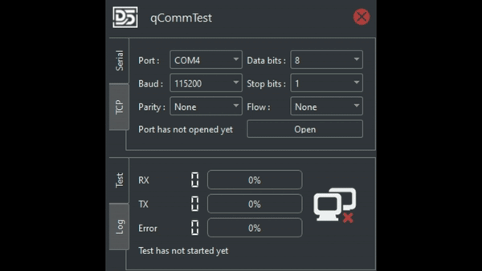

# qCommTest

Serial Communication Test Tool
- Serial COM Port / RS232
- TCP

## Usage

## :snowman: Author
Eray Öztürk ([@diffstorm](https://github.com/diffstorm))

## LICENSE
This project is licensed under the [GPL-3 License](LICENSE) - see the LICENSE file for details.
